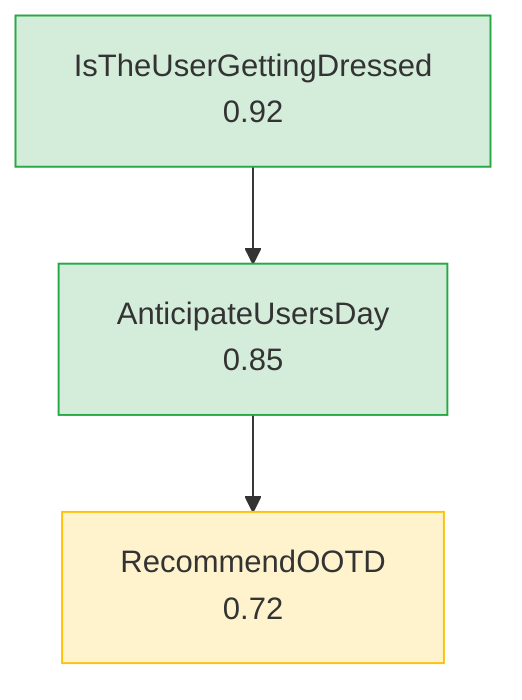

# Feature Landscape: Eval/Optimization DX for Bae v3

**Domain:** LLM agent graph evaluation, optimization, and developer workflow
**Researched:** 2026-02-08
**Confidence:** HIGH for eval patterns (verified against DSPy, Braintrust, Promptfoo, DeepEval, Inspect AI); MEDIUM for zero-config auto-generation (novel territory, no precedent found)

## Ecosystem Survey: How Eval Works Across Frameworks

### DSPy: Define -> Compile -> Evaluate

DSPy's workflow is the most relevant to bae since bae already uses DSPy for optimization.

**Eval primitives:**
- `dspy.Example` -- labeled data (input/output pairs with `.with_inputs()` to mark which fields are inputs)
- Metric function: `def metric(example, pred, trace=None) -> float | bool` -- returns float for scoring, bool for bootstrapping
- `dspy.Evaluate` class: runs a program against a devset with a metric, supports `num_threads`, `display_progress`, `return_outputs`
- Optimizers (BootstrapFewShot, MIPROv2, COPRO) consume metric + trainset and produce compiled programs

**Key pattern:** Metrics return different types based on context:
```python
def metric(example, pred, trace=None):
    score = compute_score(example, pred)
    if trace is None:  # evaluation mode
        return score  # float 0.0-1.0
    else:  # bootstrapping mode
        return score > 0.8  # bool (keep as demo?)
```

**Datasets:** DSPy needs as few as 20-200 examples. Labels needed for final outputs only -- intermediate step labels are almost never required. This is critical for bae: graph traces provide input/output pairs naturally.

**Confidence:** HIGH (verified via official DSPy docs at dspy.ai)

### Braintrust: Dataset + Task + Scorers

Braintrust structures evals as three components:
- **Dataset**: labeled examples (input + expected output)
- **Task**: the function being evaluated (your LLM pipeline)
- **Scorers**: functions that score task output against expected

Teams report getting meaningful evals running same-day. CI integration via GitHub Actions posts eval diffs on PRs. One-click: add production traces to datasets.

**Key DX insight:** Braintrust connects the full cycle -- production logs become eval datasets with one click. This "traces -> datasets" pipeline is exactly what bae needs.

**Confidence:** MEDIUM (WebSearch-verified, no hands-on testing)

### Promptfoo: Declarative YAML + CLI-First

Promptfoo is CLI-first with declarative configs:
- `promptfoo init` -- scaffolds project with YAML config
- `promptfoo eval` -- runs evals from config
- `promptfoo eval --retry-errors` -- re-runs only failed cases
- YAML defines prompts, test cases, assertions, and providers
- Built-in web viewer for side-by-side comparison
- Live reload during development

**Key DX insight:** Zero-code eval definition via YAML. Developers don't write Python to define test cases -- they write declarative configs. This is the "1 minute to first eval" pattern.

**Confidence:** MEDIUM (WebSearch + GitHub README verified)

### DeepEval: Pytest for LLMs

DeepEval treats evals as unit tests:
- `deepeval test run` instead of `pytest`
- Test cases are `LLMTestCase(input=..., actual_output=..., expected_output=...)`
- 50+ built-in metrics (G-Eval, hallucination, answer relevancy, etc.)
- Native pytest integration -- evals run in CI like regular tests
- `assert_test(test_case, metrics)` pattern

**Key DX insight:** Framing evals as tests that developers already know how to write removes the "what even is an eval?" barrier. The familiar `assert` pattern makes eval accessible.

**Confidence:** MEDIUM (WebSearch + official docs verified)

### Inspect AI: Dataset -> Solver -> Scorer

UK AISI's framework uses opinionated primitives:
- **Dataset**: labeled samples with `input` and `target` columns
- **Solver**: chain of processing steps (generate, prompt engineering, multi-turn dialog)
- **Scorer**: evaluates final output (text comparison, model grading, custom)
- VS Code log viewer for inspection
- Docker sandboxing for safe execution

**Key DX insight:** Opinionated primitives force structure. "Dataset -> Task -> Scorer" is the universal eval pattern across all frameworks.

**Confidence:** MEDIUM (WebSearch + PyPI docs verified)

### RAGAS: Metrics Without Ground Truth

RAGAS evaluates RAG systems without requiring ground truth annotations:
- Context precision, context recall, faithfulness, answer relevancy
- Synthetic test generation (auto-generates test datasets, reducing manual curation by ~90%)
- Over 400K monthly downloads, 20M+ evaluations run

**Key DX insight:** Reference-free metrics are powerful for bootstrapping. If bae can evaluate graph outputs without requiring labeled expected outputs, the barrier to entry drops dramatically.

**Confidence:** MEDIUM (WebSearch + arxiv paper verified)

---

## Table Stakes

Features developers expect from any eval system. Missing = the eval DX feels broken or unusable.

| Feature | Why Expected | Complexity | Depends On | Notes |
|---------|--------------|------------|------------|-------|
| **Dataset format (input/output pairs)** | Every framework starts here. DSPy needs `dspy.Example`, Braintrust needs dataset, Promptfoo needs YAML test cases. Without a standard format, users can't even begin. | Low | Existing `trace_to_examples()` | Bae already converts traces to `dspy.Example`. Needs a user-facing dataset abstraction on top -- JSONL files or Pydantic models. |
| **Metric function protocol** | DSPy, DeepEval, Braintrust, Inspect all use `metric(example, pred) -> score`. Without a metric, there's nothing to optimize against. | Low | Existing `node_transition_metric` | Current metric only checks type correctness. Must support quality metrics (LLM-as-judge, semantic similarity, custom). |
| **Run eval from CLI** | Promptfoo: `promptfoo eval`. DeepEval: `deepeval test run`. Inspect: `inspect eval`. Every framework has a one-command eval runner. | Low | Existing `bae run` command | Add `bae eval <module>` that loads graph + dataset + metric and prints scores. |
| **Eval results display (pass/fail + scores)** | Users need to see what passed, what failed, and why. Every framework shows per-example results with aggregate scores. | Med | CLI eval command | Table output: example input, expected, actual, score, pass/fail. |
| **Multiple examples per eval run** | Running one example is a smoke test, not an eval. Batch evaluation across a dataset is the minimum viable eval. | Low | Dataset format | DSPy's `Evaluate` already handles this. Wrap it. |
| **Save/load compiled artifacts** | DSPy programs save via `program.save()` and load via `program.load()`. Bae already has `save_optimized()`/`load_optimized()`. Must be discoverable and documented. | Low | Existing `save_optimized`, `load_optimized` | Already implemented but undiscoverable. Need CLI commands and conventions (e.g., `.compiled/` directory). |
| **Optimization from CLI** | After eval shows a baseline, users need `bae optimize <module>` to improve. | Med | Eval + dataset + metric all working | Wraps existing `CompiledGraph.optimize()` with CLI ergonomics. |
| **Clear error messages for eval failures** | When an eval fails (missing dataset, bad metric, graph error), the message must say exactly what's wrong and how to fix it. | Low | All eval components | Follow the pattern from v2 dep errors -- name the missing thing and suggest the fix. |

## Differentiators

Features that would make bae's eval DX special -- things other frameworks don't do or don't do well.

| Feature | Value Proposition | Complexity | Depends On | Notes |
|---------|-------------------|------------|------------|-------|
| **Zero-config structural eval** | Auto-generate a baseline eval from graph structure alone. No dataset, no metric, no config. Checks: does the graph complete without error? Does each node produce the right output type? Does the trace visit expected node types? Are all fields populated (non-null, non-empty)? | Med | Graph topology, existing `node_transition_metric` | **This is the 1-minute-to-first-eval killer feature.** `bae eval examples.ootd` with zero setup. Uses graph structure to generate smoke-test assertions. No other framework does this because no other framework has typed graph topology to introspect. |
| **Trace-to-dataset pipeline** | Run the graph, collect traces, automatically convert to eval datasets. `bae run` produces traces; `bae dataset add` saves a trace as a labeled example (human reviews and approves). Over time, organic dataset growth from real usage. | Med | `trace_to_examples()`, dataset format | Braintrust does "add production trace to dataset with one click." Bae can do the same from CLI. The trace IS the labeled data. |
| **Progressive metric complexity tiers** | Four tiers of eval sophistication, each building on the last: (1) structural -- type checking, completion, field population; (2) example-based -- expected output matching from dataset; (3) judge-based -- LLM evaluates quality with rubric; (4) custom -- user-defined metric functions. Each tier works without the others. | Med-High | All eval primitives | No framework explicitly designs for progressive complexity. They dump you into "write a metric" immediately. Bae should make Tier 1 automatic and each subsequent tier a 5-minute addition. |
| **Graph-aware metrics** | Metrics that understand graph structure: "Did the graph take the expected path?" "Did node X produce field Y with property Z?" "Was the trace length reasonable?" These are structural metrics that only make sense for graph-based systems. | Med | Graph topology, trace data | Unique to bae. Other frameworks evaluate single prompts or pipelines. Bae can evaluate paths through a graph, branching decisions, and per-node quality. |
| **Mermaid diagram with eval annotations** | Extend existing `bae graph show` to overlay eval results: green nodes passed, red nodes failed, scores on edges. Developers see WHERE in the graph quality breaks down. | Med | Existing `to_mermaid()`, eval results per node | LangGraph has basic graph visualization. Nobody overlays eval results on the graph diagram. This would be genuinely useful for debugging multi-node quality issues. |
| **Compiled artifact conventions** | Standard directory layout: `<domain>/.compiled/` with timestamped artifacts, metadata (optimizer used, metric score, dataset size, DSPy version), and a `latest` symlink. `.gitignore`-able but version-trackable via metadata JSON. | Low-Med | Existing save/load | DSPy docs recommend naming like `qa_program_miprov2_acc0.87_20230615.json`. Bae should standardize this with a convention. |
| **Eval diff (before/after optimization)** | `bae eval --compare baseline optimized` shows which examples improved, regressed, or stayed the same. Critical for knowing if optimization helped. | Med | Two eval runs to compare | Braintrust does this on PRs via GitHub Actions. Promptfoo has side-by-side comparison. Bae needs at minimum a CLI diff. |

## Anti-Features

Features to deliberately NOT build. These are tempting but wrong for bae's scope and philosophy.

| Anti-Feature | Why Avoid | What to Do Instead |
|--------------|-----------|-------------------|
| **Web UI for eval results** | Massive scope creep. Braintrust and Promptfoo already have UIs. Bae is a framework, not a platform. | CLI output with structured JSON. Users who want UI can pipe to Braintrust or use `bae eval --json \| jq`. |
| **Production monitoring / observability** | Eval is offline development-time activity. Production monitoring is a different product (Datadog, Braintrust, Langfuse). | Export traces in OpenTelemetry format if needed later. Don't build dashboards. |
| **Eval-as-a-service / cloud storage** | Bae is local-first. Sending eval data to a cloud service adds auth, networking, pricing complexity. | All artifacts on local filesystem. Users bring their own cloud storage if needed. |
| **Custom metric DSL** | Inventing a domain-specific language for metrics adds learning curve. Python is the DSL. | Metric functions are plain Python. `def my_metric(example, pred, trace=None) -> float`. |
| **Automated dataset curation** | Auto-generating diverse, representative datasets from scratch requires solving an open research problem. | Provide tooling for humans to curate: `bae dataset add`, `bae dataset list`, `bae dataset inspect`. Humans approve examples. |
| **Multi-model comparison matrix** | Promptfoo's strength is comparing GPT vs Claude vs Llama. Bae optimizes a single graph, not model shopping. | Support changing the LM via config. Don't build comparison infrastructure. |
| **Async eval execution** | Bae is sync-only. Adding async eval adds API complexity for marginal speed gain in a dev-time tool. | Sequential eval with progress bar. If slow, reduce dataset size or use `num_threads` via DSPy. |
| **Eval versioning / experiment tracking** | MLflow, W&B, and Braintrust already solve this. Building experiment tracking is a full product. | Save eval results as JSON with timestamp and metadata. Users who want tracking integrate with W&B (DSPy already has W&B integration). |

## Progressive Complexity Tiers

This is the core DX design. Each tier is independently useful and builds on the previous.

### Tier 0: Zero-Config Structural Eval

**Who:** Developer who just built a graph and wants to know "does this even work?"
**Effort:** 0 minutes setup
**Command:** `bae eval examples.ootd`

**What it checks:**
- Graph completes without exception
- Each node in trace is the correct type (matches graph topology)
- Terminal node is reached
- All plain fields on terminal node are populated (non-null, non-empty string)
- Trace length is within expected bounds (not stuck in loop)
- Node transition types match graph edges

**How it works internally:**
- Load graph from module
- Construct start node with default/empty values (or require `--input`)
- Run graph
- Apply structural assertions derived from `Graph.nodes`, `Graph.edges`, `Graph.terminal_nodes`
- Report pass/fail per assertion

**Output:**
```
$ bae eval examples.ootd --input '{"user_message": "ugh i just got up"}'

Structural Eval: examples.ootd
  [PASS] Graph completed without error
  [PASS] Terminal node reached: RecommendOOTD
  [PASS] Trace: IsTheUserGettingDressed -> AnticipateUsersDay -> RecommendOOTD
  [PASS] All fields populated on RecommendOOTD
  [WARN] Field 'inspo' is empty list (may be intentional)

4/4 passed, 1 warning
```

**Depends on:** Existing graph infrastructure. No new primitives needed.
**Complexity:** Low-Med

### Tier 1: Example-Based Eval

**Who:** Developer who has collected a few good traces and wants regression testing.
**Effort:** 5-10 minutes (run graph a few times, save good outputs)
**Command:** `bae eval examples.ootd --dataset ootd_examples.jsonl`

**What it checks:**
- All Tier 0 checks
- Terminal node output matches expected output from dataset (exact or fuzzy)
- Specific field values match expectations

**Dataset format (JSONL):**
```json
{"input": {"user_message": "ugh i just got up"}, "expected": {"top": "oversized sweater", "bottom": "joggers"}}
{"input": {"user_message": "big meeting today"}, "expected": {"top": "blazer"}}
```

**How it works:**
- Load dataset from JSONL
- For each example: construct start node from `input`, run graph, compare terminal node fields to `expected`
- Default comparison: exact string match per field (with case-insensitive option)
- Users can provide partial `expected` -- only specified fields are checked

**Output:**
```
$ bae eval examples.ootd --dataset ootd_examples.jsonl

Example-Based Eval: 3 examples
  [1/3] "ugh i just got up"     PASS  (2/2 fields match)
  [2/3] "big meeting today"     FAIL  (top: expected "blazer", got "button-down shirt")
  [3/3] "rainy day errands"     PASS  (3/3 fields match)

Score: 2/3 (66.7%)
```

**Depends on:** Tier 0 infrastructure + dataset loading
**Complexity:** Med

### Tier 2: LLM-as-Judge Eval

**Who:** Developer who needs quality evaluation beyond exact matching. "Is this outfit recommendation actually good?"
**Effort:** 15-30 minutes (write a rubric prompt)
**Command:** `bae eval examples.ootd --dataset examples.jsonl --judge`

**What it checks:**
- All Tier 0 checks
- LLM judge evaluates output quality against a rubric
- Rubric can be auto-generated from graph structure or user-provided

**Auto-generated rubric (from node class + field descriptions):**
```
Evaluate this RecommendOOTD output:
- top (a specific garment for the upper body): Is this a specific, real garment? Score 0-1.
- bottom (a specific garment for the lower body): Is this a specific, real garment? Score 0-1.
- footwear (specific shoes or boots): Is this specific footwear? Score 0-1.
- final_response (casual message to the user with the recommendation): Is this message casual and helpful? Score 0-1.
```

**Key insight:** Bae nodes already have `Field(description=...)` on their fields. These descriptions ARE the rubric. Auto-generating a judge prompt from field descriptions gives quality evaluation with zero rubric-writing effort.

**Best practices from research:**
- Use yes/no questions, not subjective "quality" assessments
- Ask for reasoning before scoring (chain-of-thought)
- Minimum 30-50 examples for meaningful evaluation
- Use a stronger model as judge than the model being evaluated

**Depends on:** Tier 1 + LLM-as-judge metric function
**Complexity:** Med-High

### Tier 3: Custom Metric Functions

**Who:** Developer who needs domain-specific evaluation logic.
**Effort:** As long as the metric takes to write
**Command:** `bae eval examples.ootd --dataset examples.jsonl --metric my_domain.metrics:outfit_quality`

**What it provides:**
- Full DSPy metric protocol: `def metric(example, pred, trace=None) -> float | bool`
- Access to complete trace (not just terminal node)
- Composable with built-in metrics (structural + custom)
- Used directly by DSPy optimizers when compiling

**Example:**
```python
def outfit_quality(example, pred, trace=None):
    # Check that outfit is weather-appropriate
    weather = next(n for n in trace if isinstance(n, AnticipateUsersDay))
    temp = weather.weather.temp

    # Structural checks
    has_all_pieces = bool(pred.top and pred.bottom and pred.footwear)

    # Weather appropriateness
    if temp < 50 and "shorts" in pred.bottom.lower():
        weather_appropriate = False
    else:
        weather_appropriate = True

    score = (has_all_pieces + weather_appropriate) / 2.0
    return score if trace is None else score > 0.7
```

**Depends on:** All previous tiers + user Python code
**Complexity:** Low (framework provides protocol, user writes logic)

---

## Feature Dependencies

```
Graph Structure (existing)
    |
    +---> to_mermaid() (existing)
    |         |
    |         +---> Mermaid with eval annotations (Tier 2+)
    |
    +---> Tier 0: Structural Eval
    |         |
    |         +---> CLI: bae eval <module>
    |         |
    |         +---> Structural assertions from graph topology
    |
    +---> node_to_signature() (existing)
              |
              +---> Auto-generated judge rubric from Field(description=...)

Dataset Format (new)
    |
    +---> JSONL loader
    |
    +---> Tier 1: Example-Based Eval
    |         |
    |         +---> Field-level comparison
    |
    +---> Trace-to-dataset pipeline: bae dataset add
    |
    +---> Feeds DSPy optimizers directly

Metric Protocol (extend existing)
    |
    +---> node_transition_metric (existing, Tier 0)
    |
    +---> Field match metric (Tier 1)
    |
    +---> LLM-as-judge metric (Tier 2)
    |         |
    |         +---> Rubric from Field descriptions (auto-generated)
    |         |
    |         +---> User-provided rubric (manual)
    |
    +---> Custom metric function (Tier 3)
    |
    +---> All metrics feed DSPy optimizers (BootstrapFewShot, MIPROv2)

Optimization Pipeline (extend existing)
    |
    +---> CLI: bae optimize <module>
    |
    +---> Compiled artifact conventions (.compiled/ directory)
    |
    +---> Eval diff (before/after comparison)

CLI Commands (extend existing)
    |
    +---> bae eval <module>           (Tier 0)
    +---> bae eval <module> --dataset (Tier 1)
    +---> bae eval <module> --judge   (Tier 2)
    +---> bae eval <module> --metric  (Tier 3)
    +---> bae optimize <module>       (optimization)
    +---> bae dataset add             (dataset curation)
    +---> bae dataset list            (dataset inspection)
    +---> bae graph show              (existing, extend with eval overlay)
```

## CLI Command Design

Commands bae v3 needs, in order of priority.

### Must Have

| Command | Purpose | Notes |
|---------|---------|-------|
| `bae eval <module>` | Run structural eval (Tier 0) | Zero config. Just checks if graph works. |
| `bae eval <module> --dataset <path>` | Run example-based eval (Tier 1) | Loads JSONL, compares outputs. |
| `bae eval <module> --metric <module:fn>` | Run eval with custom metric (Tier 3) | Loads metric function from module path. |
| `bae eval <module> --judge` | Run LLM-as-judge eval (Tier 2) | Auto-generates rubric from field descriptions. |
| `bae optimize <module> --dataset <path>` | Run DSPy optimization | Wraps existing CompiledGraph.optimize(). |
| `bae optimize <module> --output <dir>` | Save compiled artifacts | Saves to specified directory (default: `.compiled/`). |
| `bae dataset add <module> --input <json>` | Run graph and save trace as dataset example | Interactive: shows output, asks "save as example?" |

### Nice to Have

| Command | Purpose | Notes |
|---------|---------|-------|
| `bae eval --compare <run1> <run2>` | Diff two eval runs | Shows regressions and improvements. |
| `bae dataset list <path>` | Show dataset contents | Formatted table of examples. |
| `bae dataset inspect <path> <index>` | Show single example in detail | Full input/output with formatting. |
| `bae graph show <module> --eval-results <path>` | Mermaid diagram with eval overlay | Color nodes by pass/fail. |

## Compiled Artifact Conventions

How optimized programs should be stored and versioned.

### Directory Layout
```
my_domain/
    graph.py              # Graph definition
    .compiled/
        latest -> 2026-02-08_miprov2/    # Symlink to best
        2026-02-08_miprov2/
            metadata.json                 # Run metadata
            IsTheUserGettingDressed.json  # Per-node predictor state
            AnticipateUsersDay.json
            RecommendOOTD.json
        2026-02-07_bootstrap/
            metadata.json
            ...
```

### Metadata Format
```json
{
    "optimizer": "MIPROv2",
    "metric": "outfit_quality",
    "metric_score": 0.87,
    "dataset_size": 50,
    "dataset_path": "ootd_examples.jsonl",
    "dspy_version": "2.6.1",
    "bae_version": "3.0.0",
    "timestamp": "2026-02-08T14:30:00Z",
    "duration_seconds": 120,
    "node_scores": {
        "IsTheUserGettingDressed": 0.92,
        "AnticipateUsersDay": 0.85,
        "RecommendOOTD": 0.84
    }
}
```

### Conventions
- `.compiled/` is `.gitignore`-able (binary artifacts don't belong in git)
- `metadata.json` IS git-trackable (small, human-readable, documents what was compiled)
- `latest` symlink points to the best-performing compilation
- DSPy version compatibility: same version for save and load (DSPy <3.0 doesn't guarantee backward compat)
- Use `save_program=False` (JSON state only, not cloudpickle) for security and readability

## Mermaid Diagram Enhancements

What developers need to see in graph visualizations.

### Current (already built)
- Node names with edges showing topology
- Terminal nodes styled differently (double circle)

### Eval Overlay (v3 addition)


**What to show:**
- Per-node eval scores (from graph-aware metrics)
- Color coding: green (>0.8), yellow (0.5-0.8), red (<0.5)
- Field descriptions on hover (useful in mermaid.live)
- Edge labels for transition frequency (from dataset)

**What NOT to show:**
- Full field values (too noisy)
- Trace-level detail (belongs in CLI output, not diagram)

## Zero-Config Eval: Can You Auto-Generate Meaningful Evals From Graph Structure?

**Short answer:** Yes, for structural correctness. No, for quality.

**What can be auto-generated (HIGH confidence):**

1. **Completion check** -- graph runs to terminal node without exception
2. **Type correctness** -- each trace node matches graph topology (existing `node_transition_metric`)
3. **Field population** -- all plain fields on all nodes are non-null, non-empty
4. **Trace shape** -- trace visits expected node types, length within bounds
5. **Edge validity** -- each transition is a valid edge in the graph

**What CANNOT be auto-generated:**

1. **Output quality** -- "Is this outfit recommendation good?" requires domain knowledge
2. **Input diversity** -- meaningful test inputs require understanding the domain
3. **Edge case coverage** -- knowing what inputs trigger different paths requires human judgment
4. **Business logic correctness** -- field values being correct (not just present) needs labeled data

**The strategy:** Tier 0 (structural) is fully auto-generated. It's a smoke test that catches crashes, type errors, and stuck loops. It's NOT a quality test. Make this extremely clear in docs and CLI output:

```
$ bae eval examples.ootd --input '...'

STRUCTURAL EVAL (checks correctness, not quality)
  [PASS] Graph completed
  [PASS] Types correct
  [PASS] Fields populated

To evaluate output QUALITY, add a dataset:
  bae eval examples.ootd --dataset examples.jsonl
```

**Confidence:** HIGH for structural checks. The information needed is already in `Graph.nodes`, `Graph.edges`, `Graph.terminal_nodes`, and the Pydantic model schemas.

## LLM-as-Judge Accessibility

How to make LLM-as-judge evaluation accessible to developers who've never written a rubric.

### Auto-Generated Rubric From Field Descriptions

Bae has a unique advantage: `Field(description=...)` on node fields already contains evaluation criteria. A node like:

```python
class RecommendOOTD(Node):
    top: str = Field(description="a specific garment for the upper body")
    bottom: str = Field(description="a specific garment for the lower body")
    footwear: str = Field(description="specific shoes or boots")
```

...can auto-generate a judge prompt:

```
Evaluate each field of this output. For each field, answer YES or NO:

1. top: "oversized cashmere sweater"
   Criteria: Is this "a specific garment for the upper body"?
   Answer YES or NO, then explain briefly.

2. bottom: "dark wash jeans"
   Criteria: Is this "a specific garment for the lower body"?
   Answer YES or NO, then explain briefly.
...
```

This gives quality evaluation with ZERO rubric-writing effort. The `description` strings become the criteria.

### Best Practices to Encode

From research on LLM-as-judge patterns:

1. **Yes/no questions over subjective scales** -- "Is this a specific garment?" not "Rate garment specificity 1-5"
2. **Ask for reasoning before scoring** -- judge explains, then scores. Improves quality.
3. **Use a stronger model as judge** -- if graph uses claude-sonnet, judge with claude-opus
4. **Minimum 30-50 examples** for meaningful aggregate scores
5. **Field-level scoring, not output-level** -- score each field independently, then aggregate

### Progressive Judge Complexity

| Level | Effort | What It Does |
|-------|--------|--------------|
| `--judge` | 0 minutes | Auto-generates rubric from Field descriptions |
| `--judge --rubric "Is this weather-appropriate?"` | 1 minute | Adds custom criteria to auto-generated rubric |
| `--judge --rubric-file rubric.txt` | 5 minutes | Full custom rubric from file |
| `--metric my_module:custom_judge` | 30+ minutes | Full custom metric with LLM judge calls inside |

## The Progressive Path: No Evals to Evals in CI

How a team goes from zero to production evals, mapped to bae's tier system.

### Day 1: "Does it even work?"
```bash
bae eval my_graph --input '{"query": "hello"}'
# Tier 0: structural check, 30 seconds
```

### Week 1: "Let me save some good outputs"
```bash
bae run my_graph --input '{"query": "hello"}'
# Like the output? Save it:
bae dataset add my_graph --input '{"query": "hello"}'
# Repeat 5-10 times with different inputs
```

### Week 2: "Regression testing"
```bash
bae eval my_graph --dataset my_examples.jsonl
# Tier 1: example-based, catches regressions
```

### Week 3: "Quality measurement"
```bash
bae eval my_graph --dataset my_examples.jsonl --judge
# Tier 2: LLM-as-judge with auto-generated rubric
```

### Week 4: "Optimization"
```bash
bae optimize my_graph --dataset my_examples.jsonl --metric my_metrics:quality
bae eval my_graph --dataset my_examples.jsonl --compare .compiled/baseline .compiled/latest
# Tier 3: custom metrics feeding DSPy optimizers
```

### Month 2: "CI/CD"
```yaml
# .github/workflows/eval.yml
- run: bae eval my_graph --dataset examples.jsonl --judge --fail-under 0.8
```

## Key Insights From Research

### 1. The Universal Eval Pattern Is Dataset + Task + Metric

Every framework converges on the same three primitives: (1) labeled data, (2) the thing being evaluated, (3) a scoring function. DSPy calls them Example/Program/Metric. Braintrust calls them Dataset/Task/Scorer. Inspect calls them Dataset/Solver/Scorer. Bae should not invent new terminology -- use the standard primitives.

### 2. The DX Gap Is "What Metric Do I Write?"

The number one barrier to eval adoption is metric definition. Developers stare at `def metric(example, pred) -> float` and don't know what to put inside. DSPy's docs acknowledge this: "getting this right on the first try is unlikely." Bae's auto-generated structural and judge metrics remove this barrier entirely for the first two tiers.

### 3. Graph Structure Is an Eval Advantage

No other framework has typed graph topology to introspect. Promptfoo evaluates prompts. DSPy evaluates programs. Braintrust evaluates tasks. None of them can say "the graph should visit nodes A, B, C in order and the transition from B to C should produce field X with property Y." Bae's graph structure is rich metadata for evaluation that no competitor can match.

### 4. Traces Are Organic Datasets

DSPy needs only 20-200 examples. Bae traces already contain input/output pairs for every node transition. Running the graph 20 times with different inputs generates a training set. The `trace_to_examples()` function already exists. The DX gap is making this discoverable and ergonomic.

### 5. DSPy Optimization Needs Good Metrics to Be Useful

BootstrapFewShot and MIPROv2 are only as good as the metric they optimize against. The current `node_transition_metric` (type checking) means optimization can only improve type prediction accuracy -- it can't improve output quality. Quality metrics are the prerequisite for useful optimization.

### 6. Compiled Artifacts Need Conventions, Not Infrastructure

DSPy's save/load is simple (JSON files). What's missing is conventions: where to save, how to name, how to track which compilation is "current." This is a docs + conventions problem, not a code problem.

## Confidence Assessment

| Claim | Confidence | Reasoning |
|-------|------------|-----------|
| Universal eval pattern is dataset + task + metric | HIGH | Verified across 6 frameworks -- all converge on this. |
| Zero-config structural eval is feasible from graph topology | HIGH | Graph.nodes, edges, terminal_nodes already contain needed info. |
| Auto-generated judge rubric from Field descriptions is novel | HIGH | No framework does this. Bae's Field(description=...) is unique metadata source. |
| Progressive complexity tiers (0-3) will work in practice | MEDIUM | Pattern is sound but untested. Each tier needs validation. |
| 20-200 examples is sufficient for DSPy optimization | HIGH | Stated explicitly in DSPy official docs. |
| Trace-to-dataset pipeline is the right organic growth model | MEDIUM | Braintrust validates the pattern. Bae's traces are structurally suitable. |
| Mermaid eval overlay is useful for debugging | MEDIUM | LangGraph visualization is popular. Eval overlay is speculative but logical. |
| Compiled artifact conventions are sufficient (no versioning system needed) | HIGH | DSPy community uses simple file naming. W&B integration exists for teams who want more. |

## Sources

**Official Documentation (HIGH confidence):**
- [DSPy Metrics](https://dspy.ai/learn/evaluation/metrics/) -- Metric function protocol, examples
- [DSPy Evaluation Overview](https://dspy.ai/learn/evaluation/overview/) -- Dataset requirements, workflow
- [DSPy Optimizers](https://dspy.ai/learn/optimization/optimizers/) -- BootstrapFewShot, MIPROv2, parameters
- [DSPy Saving and Loading](https://dspy.ai/tutorials/saving/) -- Artifact storage, versioning caveats
- [DSPy Cheatsheet](https://dspy.ai/cheatsheet/) -- Quick reference for all patterns

**Framework Documentation (MEDIUM confidence):**
- [Promptfoo CLI](https://www.promptfoo.dev/docs/usage/command-line/) -- CLI command patterns
- [Promptfoo Intro](https://www.promptfoo.dev/docs/intro/) -- Declarative eval config
- [DeepEval Getting Started](https://deepeval.com/docs/getting-started) -- Pytest-based eval pattern
- [DeepEval CI/CD](https://deepeval.com/docs/evaluation-unit-testing-in-ci-cd) -- Eval in CI
- [Braintrust How to Eval](https://www.braintrust.dev/articles/how-to-eval) -- Dataset/Task/Scorer pattern
- [Braintrust CI/CD Tools](https://www.braintrust.dev/articles/best-ai-evals-tools-cicd-2025) -- CI integration patterns
- [Inspect AI](https://inspect.aisi.org.uk/) -- Dataset/Solver/Scorer primitives

**LLM-as-Judge Research (MEDIUM confidence):**
- [Monte Carlo Data: LLM-as-Judge Best Practices](https://www.montecarlodata.com/blog-llm-as-judge/) -- 7 best practices
- [Evidently AI: LLM-as-Judge Guide](https://www.evidentlyai.com/llm-guide/llm-as-a-judge) -- Patterns and anti-patterns
- [Confident AI: LLM-as-Judge Explained](https://www.confident-ai.com/blog/why-llm-as-a-judge-is-the-best-llm-evaluation-method) -- When to use, validation sets

**Ecosystem Surveys (LOW confidence, used for landscape awareness):**
- [AI Multiply: LLM Eval Landscape 2026](https://research.aimultiple.com/llm-eval-tools/) -- Framework comparison
- [Confident AI: Top LLM Eval Tools 2025](https://www.confident-ai.com/blog/greatest-llm-evaluation-tools-in-2025) -- Market overview

---

*Research conducted: 2026-02-08*
*Supersedes: 2026-02-07 FEATURES.md (which covered v2 Context Frames)*
*Focus: Eval/optimization DX for bae v3 milestone*
