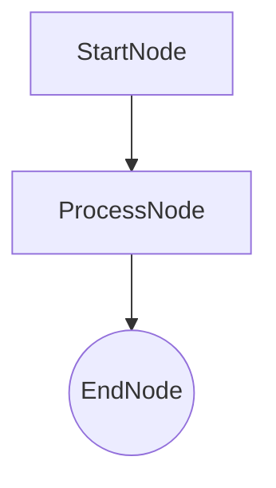

# Technology Stack: v3.0 Eval/Optimization DX

**Project:** Bae - Type-driven agent graphs with DSPy optimization
**Researched:** 2026-02-08
**Focus:** Stack additions for eval/optimization developer workflow, CLI tooling, LLM-as-judge, and package scaffolding
**Overall confidence:** HIGH for DSPy integration, MEDIUM for alternative eval frameworks

---

## Executive Summary

Bae v3.0's eval/optimization DX needs **3 new dependencies** and leverages **1 existing dependency more deeply** (DSPy). The core insight: DSPy already has everything needed for evals and optimization -- `dspy.Evaluate`, `EvaluationResult`, and three optimizer tiers (BootstrapFewShot, MIPROv2, SIMBA). Bae's job is not to build eval infrastructure but to **wrap DSPy's eval primitives in a zero-friction CLI** that converts bae graph concepts to DSPy concepts transparently.

For LLM-as-judge, DSPy's own pattern (use `dspy.Predict(Assess)` inside a metric function) is the right approach -- it integrates natively with optimization. External eval frameworks (DeepEval, RAGAS, Braintrust) are overkill for bae's use case and would add dependency bloat.

New dependencies: `rich` (eval output formatting), `copier` (project scaffolding, dev-only), and no new eval framework -- DSPy covers it.

---

## Recommended Stack Changes

### Add

| Package | Version | Purpose | Why |
|---------|---------|---------|-----|
| `rich` | >=14.0 | Eval result tables, progress bars, trace visualization in CLI | Already a transitive dep of typer. Making it explicit enables direct use for eval output formatting (tables, color-coded scores, progress). |

### Add (dev/optional only)

| Package | Version | Purpose | Why |
|---------|---------|---------|-----|
| `copier` | >=9.0 | Project scaffolding via `bae new` command | For `bae new my_domain` -> generates `my_domain/graph.py` + `graph.md`. Install via `uv tool install copier` or `pipx`, not as project dep. Template lives in bae repo. |

### Keep (leverage more deeply)

| Package | Current Version | New v3 Role |
|---------|----------------|-------------|
| `dspy` | 3.1.2 (latest: 3.1.3) | `dspy.Evaluate` for eval runs, MIPROv2/SIMBA for optimization, LLM-as-judge via `dspy.Predict(Assess)` inside metric functions |
| `typer` | >=0.12 (latest: 0.21.1) | New CLI commands: `bae eval`, `bae optimize`, `bae inspect` |
| `pydantic` | 2.12.5 | Eval dataset schemas, metric result models |

### Do NOT Add

| Temptation | Why Not | What Instead |
|------------|---------|--------------|
| **DeepEval** | 50+ metrics is massive scope creep; bae needs 3-5 metric patterns, not 50. DeepEval's Confident AI cloud platform is vendor lock-in. | DSPy metric functions (plain Python). |
| **RAGAS** | RAG-specific (context_relevancy, faithfulness). Bae is agent graphs, not RAG pipelines. Wrong abstraction. | Custom metrics via DSPy. |
| **Braintrust / autoevals** | Cloud platform dependency. `autoevals` library is useful standalone but adds 130+ KB for features DSPy already provides natively. | DSPy LLM-as-judge pattern with `dspy.Predict`. |
| **Promptfoo** | Node.js-based, YAML config paradigm. Bae is Python-native with type hints. Impedance mismatch. | DSPy eval + bae CLI. |
| **Inspect AI** | Excellent framework but designed for benchmark evals (safety, capability). Bae needs dev-loop evals (quality iteration). Different use case. | DSPy eval for iteration, possibly Inspect for benchmarking later. |
| **judges** (quotient-ai) | Small, focused library but depends on `instructor`. Redundant with DSPy's built-in `dspy.Predict(Assess)` pattern for LLM-as-judge. | DSPy metric with Assess signature. |
| **mermaid-py** | Uses external mermaid.ink service for rendering. Bae already generates raw Mermaid text via `Graph.to_mermaid()`. No rendering library needed. | String concatenation in `Graph.to_mermaid()` (already works). |
| **pymermaider** | Generates class diagrams from code. Bae needs graph (flowchart) diagrams from type hints, which it already does. | Existing `Graph.to_mermaid()`. |
| **cookiecutter** | No template update support. Copier supports updating projects when template evolves. | Copier for scaffolding. |

---

## Deep Dive: DSPy Eval/Optimization (Current State)

### DSPy Version: 3.1.3 (Feb 5, 2026)

**Confidence: HIGH** -- verified against [PyPI](https://pypi.org/project/dspy/) and [official docs](https://dspy.ai/)

### dspy.Evaluate API

The core eval primitive. Bae should wrap this, not replace it.

```python
from dspy.evaluate import Evaluate

evaluator = Evaluate(
    devset=devset,               # list[dspy.Example]
    metric=your_metric,          # Callable(example, pred, trace=None) -> float|bool
    num_threads=4,               # Parallel eval
    display_progress=True,       # Progress bar
    display_table=5,             # Show N rows of results
    max_errors=5,                # Fail after N errors
    save_as_json="results.json", # Persist results
)

result = evaluator(your_program)
# result.score -> float (e.g., 67.3)
# result.results -> list[(example, prediction, score)]
```

**Key insight:** `Evaluate.__call__` returns an `EvaluationResult` with `.score` (float percentage) and `.results` (list of (example, prediction, score) tuples). This is everything bae needs to display eval results in a rich CLI table.

### DSPy Metric Patterns

Metrics are plain Python functions. Three patterns relevant to bae:

#### Pattern 1: Type-Check Metric (what bae has now)

```python
def node_transition_metric(example, pred, trace=None):
    match = expected_type == predicted_type
    return match if trace is not None else (1.0 if match else 0.0)
```

#### Pattern 2: Field Comparison Metric (zero-config quality)

```python
def field_quality_metric(example, pred, trace=None):
    """Compare expected vs actual field values."""
    score = 0.0
    total = 0
    for field in expected_fields:
        if getattr(pred, field, None) == getattr(example, field, None):
            score += 1.0
        total += 1
    return score / total if total else 0.0
```

#### Pattern 3: LLM-as-Judge Metric (the key new capability)

```python
class Assess(dspy.Signature):
    """Assess the quality of an answer on a given dimension."""
    assessed_text: str = dspy.InputField()
    assessment_question: str = dspy.InputField()
    assessment_answer: bool = dspy.OutputField()

def quality_metric(example, pred, trace=None):
    assessor = dspy.Predict(Assess)
    result = assessor(
        assessed_text=pred.output,
        assessment_question="Is this response helpful and accurate?"
    )
    return result.assessment_answer
```

**Critical:** When a metric itself uses `dspy.Predict`, it participates in DSPy's trace during optimization. This means MIPROv2/SIMBA can optimize the judge prompt too -- a capability no external eval framework provides.

### DSPy Optimizer Tiers

Bae should expose these as progressive optimization levels:

| Tier | Optimizer | What It Optimizes | Compute Cost | When to Use |
|------|-----------|-------------------|--------------|-------------|
| 1 | `BootstrapFewShot` | Few-shot examples only | Low (1 pass) | First try, <50 examples |
| 2 | `MIPROv2(auto="light")` | Instructions + examples | Medium (Bayesian search) | Have 50+ examples, want better prompts |
| 3 | `MIPROv2(auto="medium")` | Instructions + examples | High (more trials) | Production prep |
| 4 | `MIPROv2(auto="heavy")` | Instructions + examples | Very high | Maximum quality |
| 5 | `SIMBA` | Self-reflective rules + demos | High (introspective) | Large LLMs, hard tasks |

**Bae already uses tier 1** (BootstrapFewShot in `optimizer.py`). v3 adds tiers 2-5 as CLI options.

### MIPROv2 API (for bae integration)

```python
optimizer = dspy.MIPROv2(
    metric=metric_fn,
    auto="light",                    # "light" | "medium" | "heavy"
    max_bootstrapped_demos=4,        # Generated examples
    max_labeled_demos=4,             # From dataset
    num_threads=4,                   # Parallel
    verbose=True,                    # Progress output
    log_dir="./optimization_logs",   # Save logs
)

optimized = optimizer.compile(
    student=dspy_program,
    trainset=trainset,
    minibatch=True,                  # Faster for large datasets
    minibatch_size=35,
)
```

### SIMBA API (newer, experimental)

```python
optimizer = dspy.SIMBA(
    metric=metric_fn,
    max_steps=8,                     # Optimization iterations
    max_demos=4,                     # Max demos per predictor
    bsize=32,                        # Mini-batch size
    num_candidates=6,                # Candidates per iteration
)

optimized = optimizer.compile(
    student=dspy_program,
    trainset=trainset,
)
# optimized.candidate_programs -> list of candidates
# optimized.trial_logs -> optimization history
```

---

## Deep Dive: LLM-as-Judge Approaches

### Recommendation: DSPy-native Assess pattern

**Why not external libraries:**

| Library | Approach | Why Not for Bae |
|---------|----------|-----------------|
| `judges` (quotient-ai) | Instructor-based classifiers/graders | Adds `instructor` dep. DSPy's `dspy.Predict(Assess)` does the same thing natively. |
| `autoevals` (Braintrust) | Pre-built LLM scorers (Factuality, etc.) | Useful concepts but the library is external to DSPy. Metric functions wouldn't participate in DSPy optimization traces. |
| `deepeval` | G-Eval, hallucination detection | 50+ metrics, massive scope. G-Eval pattern is implementable in 10 lines with `dspy.Predict`. |

**The killer advantage of DSPy-native LLM-as-judge:** When your metric uses `dspy.Predict`, DSPy can optimize the judge itself. External frameworks evaluate but don't participate in the optimization loop.

### Bae's LLM-as-Judge Design

Progressive complexity for metric authoring:

```python
# Level 0: Zero-config (type-check only -- what exists today)
# No metric needed, bae provides node_transition_metric

# Level 1: Example-based (user provides expected outputs)
# Bae generates a field comparison metric automatically
# User just needs: input -> expected_output pairs

# Level 2: LLM-as-Judge (user provides assessment questions)
# Bae generates a dspy.Predict(Assess) metric
# User writes: "Is the outfit recommendation weather-appropriate?"

# Level 3: Custom metric (user writes Python)
# Full control, plain function signature
def my_metric(example, pred, trace=None) -> float | bool:
    ...
```

---

## Deep Dive: CLI Tooling

### Current State

Bae already has a `typer` CLI with:
- `bae graph show/export/mermaid` -- visualization
- `bae run` -- execute a graph

### New Commands for v3

| Command | Purpose | Key Dependencies |
|---------|---------|-----------------|
| `bae eval <module>` | Run evals against a dataset | `dspy.Evaluate`, `rich` for output |
| `bae optimize <module>` | Run optimization (bootstrap/mipro/simba) | DSPy optimizers |
| `bae inspect <module>` | Show graph stats, node signatures, compiled prompts | `rich` tables |
| `bae new <name>` | Scaffold a new graph project | `copier` (external tool) |

### Typer + Rich Integration

Typer already includes Rich as a dependency. The integration is natural:

```python
from rich.console import Console
from rich.table import Table
from rich.progress import Progress

console = Console()

# Eval results table
table = Table(title="Eval Results")
table.add_column("Example", style="cyan")
table.add_column("Score", style="green")
table.add_column("Prediction", style="white")
console.print(table)

# Optimization progress
with Progress() as progress:
    task = progress.add_task("Optimizing...", total=num_trials)
    ...
```

### Typer Version Notes

Typer 0.21.1 (Jan 2026) supports Python 3.9-3.14. Bae's `>=0.12` floor is fine but should be bumped to `>=0.15` to guarantee Rich markup support in help text.

---

## Deep Dive: Mermaid Diagram Generation

### Current State (Already Sufficient)

`Graph.to_mermaid()` already generates Mermaid flowchart syntax from type hints:

```python
def to_mermaid(self) -> str:
    lines = ["graph TD"]
    for node_cls, successors in self._nodes.items():
        node_name = node_cls.__name__
        if node_cls.is_terminal():
            lines.append(f"    {node_name}(({node_name}))")
        for succ in successors:
            lines.append(f"    {node_name} --> {succ.__name__}")
    return "\n".join(lines)
```

### What to Add for v3

No new library needed. Extend existing `to_mermaid()` with:

1. **Field annotations** -- show Dep/Recall/plain fields in node boxes
2. **Compiled status** -- indicate which nodes have optimized prompts
3. **Eval scores** -- overlay per-node scores on the diagram

These are string formatting changes, not library additions.

### For Package Scaffolding

When `bae new` scaffolds a project, the template should generate a `graph.md` file that includes the Mermaid diagram as a fenced code block:

````markdown
# My Graph


````

This is a template concern, not a library concern.

---

## Deep Dive: Package Scaffolding

### Recommendation: Copier (not Cookiecutter)

**Copier 9.11.3** (Jan 23, 2026) is the right choice for `bae new`:

| Feature | Cookiecutter | Copier |
|---------|-------------|--------|
| Template updates | No | Yes -- `copier update` syncs changes |
| Config format | JSON | YAML |
| Migrations | No | Yes |
| Python version | 3.8+ | 3.10+ (fine for bae's 3.14+ requirement) |
| Install method | pip/pipx | pip/pipx/uv |

### Integration Strategy

Copier is NOT a project dependency. It's an external tool invoked by the CLI:

```python
@app.command("new")
def new_project(name: str):
    """Scaffold a new bae graph project."""
    import subprocess
    template_path = Path(__file__).parent / "templates" / "graph-project"
    subprocess.run(["copier", "copy", str(template_path), name])
```

If copier is not installed, the CLI should print installation instructions:

```
Error: copier not found. Install with:
  uv tool install copier
  # or: pipx install copier
```

### Template Structure

```
bae/templates/graph-project/
    copier.yml              # Template config (questions)
    {{project_name}}/
        __init__.py
        graph.py.jinja      # Starter graph with 3 nodes
        evals/
            __init__.py
            dataset.json    # Empty eval dataset
        compiled/
            .gitkeep        # Compiled artifacts go here
    graph.md.jinja          # Auto-generated mermaid diagram
    pyproject.toml.jinja    # With bae dependency
```

---

## Updated `pyproject.toml` Changes

```toml
[project]
name = "bae"
version = "0.3.0"
dependencies = [
    "pydantic>=2.11",
    "pydantic-ai>=0.1",
    "dspy>=3.1",             # Bump from >=2.0; need Evaluate, MIPROv2, SIMBA
    "typer>=0.15",           # Bump from >=0.12; Rich markup support
    "rich>=14.0",            # Make explicit (was transitive via typer)
]

[project.optional-dependencies]
dev = [
    "pytest>=8.0",
    "pytest-asyncio>=0.24",
    "ruff>=0.8",
]
```

**Note on DSPy version floor:** Bumping to `>=3.1` because MIPROv2 auto parameter and SIMBA optimizer are features of the 3.x line. The `EvaluationResult` return type from `Evaluate.__call__` was also finalized in 3.x.

**Note on Rich:** Already a transitive dependency of Typer, but making it explicit allows `from rich.table import Table` without relying on transitive installation. Zero additional download.

---

## DSPy Evolution: What Changed Since 2024

For context on bae's existing integration and what's new:

### What Bae Already Uses (v1.0, Still Valid)

| Feature | Status | Notes |
|---------|--------|-------|
| `dspy.Signature` / `dspy.make_signature` | Stable | Core API, no changes |
| `dspy.Predict` | Stable | Core API, no changes |
| `BootstrapFewShot` | Stable | Working in `optimizer.py` |
| `dspy.Example` | Stable | Working in `trace_to_examples()` |

### What's New (Available for v3.0)

| Feature | Added In | Use for Bae |
|---------|----------|-------------|
| `dspy.Evaluate` returning `EvaluationResult` | DSPy 3.x | Replace manual eval loops with structured evaluation |
| `MIPROv2` with `auto` parameter | DSPy 2.5+ | One-line optimization: `MIPROv2(metric, auto="light")` |
| `SIMBA` optimizer | DSPy 3.x | Self-reflective optimization for harder tasks |
| `Evaluate.save_as_json` / `save_as_csv` | DSPy 3.x | Persist eval results without custom code |
| `EvaluationResult.results` | DSPy 3.x | Per-example scores for detailed analysis |
| `metric_threshold` on optimizers | DSPy 3.x | Stop optimization when quality target reached |
| `log_dir` on MIPROv2 | DSPy 3.x | Optimization run logging for inspection |

### What Bae Should Upgrade

| Current | Upgrade To | Reason |
|---------|-----------|--------|
| Manual eval in test scripts | `dspy.Evaluate` wrapper | Structured results, parallel eval, progress display |
| `BootstrapFewShot` only | `BootstrapFewShot` -> `MIPROv2` -> `SIMBA` progression | Progressive optimization intensity |
| `node_transition_metric` (type-only) | Quality metrics (field comparison, LLM-as-judge) | Current metric only checks "did you pick the right type?" -- says nothing about output quality |
| Manual save/load in `optimizer.py` | DSPy's built-in `save`/`load` + bae wrapper | Already using `predictor.save()`, just needs better DX around it |

---

## Version Compatibility Matrix

| Component | Minimum | Latest | Installed | Bae Requires |
|-----------|---------|--------|-----------|-------------|
| Python | 3.10 (DSPy) | 3.14 | 3.14 | >=3.14 |
| `dspy` | 3.1.0 | 3.1.3 | 3.1.2 | >=3.1 |
| `pydantic` | 2.11 | 2.12.5 | 2.12.5 | >=2.11 |
| `typer` | 0.15 | 0.21.1 | >=0.12 | >=0.15 |
| `rich` | 14.0 | 14.3.2 | (transitive) | >=14.0 |
| `copier` | 9.0 | 9.11.3 | (external tool) | >=9.0 (tool, not dep) |

---

## Confidence Assessment

| Claim | Confidence | Verification |
|-------|------------|--------------|
| DSPy 3.1.3 is latest; `dspy.Evaluate` returns `EvaluationResult` | HIGH | [PyPI](https://pypi.org/project/dspy/), [DSPy docs](https://dspy.ai/api/evaluation/Evaluate/) |
| MIPROv2 `auto` parameter accepts "light"/"medium"/"heavy" | HIGH | [DSPy MIPROv2 docs](https://dspy.ai/api/optimizers/MIPROv2/) |
| SIMBA exists with `compile(student, trainset)` API | HIGH | [DSPy SIMBA docs](https://dspy.ai/api/optimizers/SIMBA/) |
| DSPy LLM-as-judge pattern uses `dspy.Predict(Assess)` in metrics | HIGH | [DSPy metrics docs](https://dspy.ai/learn/evaluation/metrics/) |
| Rich is a transitive dep of Typer | HIGH | [Typer docs](https://typer.tiangolo.com/) -- Rich is standard dependency |
| Copier 9.11.3 supports template updates | HIGH | [PyPI](https://pypi.org/project/copier/), [Copier docs](https://copier.readthedocs.io/) |
| External eval frameworks (DeepEval, RAGAS) are overkill for bae | MEDIUM | Architectural judgment based on bae's scope vs framework scope |
| `judges` library depends on `instructor` | MEDIUM | [PyPI](https://pypi.org/project/judges/) -- checked deps |
| Typer 0.15+ has Rich markup support | MEDIUM | [Typer release notes](https://typer.tiangolo.com/release-notes/) -- inferred from changelog |

---

## Sources

### Primary (HIGH confidence)

- [DSPy Evaluate API](https://dspy.ai/api/evaluation/Evaluate/) -- Evaluate class constructor, `__call__` method, EvaluationResult
- [DSPy EvaluationResult](https://dspy.ai/api/evaluation/EvaluationResult/) -- Result structure with score and results list
- [DSPy Metrics](https://dspy.ai/learn/evaluation/metrics/) -- Metric authoring patterns including LLM-as-judge
- [DSPy MIPROv2 API](https://dspy.ai/api/optimizers/MIPROv2/) -- Constructor, compile method, auto parameter
- [DSPy SIMBA API](https://dspy.ai/api/optimizers/SIMBA/) -- Constructor, compile method, introspective optimization
- [DSPy Cheatsheet](https://dspy.ai/cheatsheet/) -- Recommended eval/optimization workflow progression
- [DSPy Optimizers Overview](https://dspy.ai/learn/optimization/optimizers/) -- Optimizer comparison and selection guide
- [DSPy PyPI](https://pypi.org/project/dspy/) -- Version 3.1.3, Feb 5 2026
- [Typer PyPI](https://pypi.org/project/typer/) -- Version 0.21.1, Jan 6 2026
- [Rich PyPI](https://pypi.org/project/rich/) -- Version 14.3.2, Feb 1 2026
- [Copier PyPI](https://pypi.org/project/copier/) -- Version 9.11.3, Jan 23 2026

### Secondary (MEDIUM confidence)

- [Braintrust autoevals](https://github.com/braintrustdata/autoevals) -- Pre-built LLM scorers, evaluated and decided against
- [judges library](https://github.com/quotient-ai/judges) -- LLM-as-judge evaluators, evaluated and decided against
- [DeepEval](https://deepeval.com/docs/getting-started) -- Comprehensive LLM eval framework, evaluated and decided against
- [RAGAS](https://docs.ragas.io/en/stable/) -- RAG evaluation framework, not applicable to agent graphs
- [Inspect AI](https://inspect.aisi.org.uk/) -- AISI eval framework, different use case (benchmarks vs dev-loop)
- [Promptfoo](https://www.promptfoo.dev/) -- Node.js eval toolkit, wrong ecosystem
- [Copier vs Cookiecutter comparison](https://medium.com/@gema.correa/from-cookiecutter-to-copier-uv-and-just-the-new-python-project-stack-90fb4ba247a9)

### Previous Research (this project)

- v2.0 STACK.md (2026-02-07) -- DAG resolution, Annotated metadata, field categorization (all still valid, not repeated here)
- v1.0 codebase STACK.md (2026-02-04) -- Base stack analysis

---

*Stack research for v3.0 eval/optimization DX: 2026-02-08*
